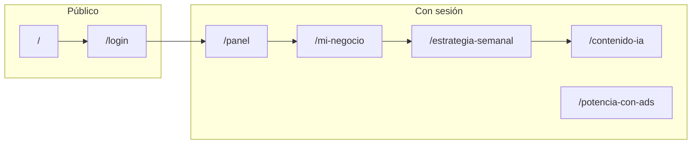

# MarketMate (hackitba2026)

Aplicación web para **PYMEs**: onboarding del negocio, importación simulada de tienda (Tienda Nube / Shopify), **estrategia de marketing semanal** generada con IA (Claude), **contenido con imágenes IA** (Pollinations/Flux) y panel de **métricas mock** del catálogo importado.

Stack principal: **Next.js 16** (App Router), **React 19**, **Tailwind CSS 4**, **Supabase** (auth + Postgres), **Vercel AI SDK** + **Anthropic**.

---

## Cómo usar la página web (flujo en pasos)

Seguí este orden para sacarle provecho a MarketMate sin perderte:

1. **Entrá a la web**  
   Abrí la URL del sitio (local: `http://localhost:3000` tras `npm run dev`). Vas a ver la página de inicio con el propósito del producto y botones para **iniciar sesión** o **ir al panel** si ya tenés cuenta.

2. **Creá cuenta o iniciá sesión**  
   En **Login** podés registrarte con email y contraseña o entrar si ya estás dado de alta. Al entrar, la app te lleva al **Panel** (resumen de tu tienda).

3. **Completá lo mínimo del negocio**  
   Abrí **Mi negocio** (menú inferior izquierdo o desde el panel). En el asistente por pasos cargá al menos el **nombre del negocio** y el **sector (rubro)** y **guardá**. Sin eso, el menú no te deja usar Estrategia ni Contenido IA con normalidad.

4. **(Opcional) Conectá o importá la tienda**  
   En los pasos de **Conectividad** podés pegar la URL de Tienda Nube o Shopify y usar **Importar** para traer un catálogo y métricas de ejemplo (simulado). Eso alimenta el **Panel**, la **estrategia** y las sugerencias de la IA.

5. **Revisá el Panel**  
   En **Panel** (primera opción del menú) ves un resumen: ventas simuladas, productos destacados, carritos abandonados y catálogo, si ya importaste tienda.

6. **Generá tu estrategia de la semana**  
   Entrá a **Estrategia**. Si no hay plan, usá **Regenerar estrategia** para que la IA arme acciones por día según tus horas disponibles y tu negocio. El plan se guarda para la semana actual; podés volver a entrar otro día y seguir viéndolo.

7. **Contenido con IA**  
   En **Contenido IA** podés generar imágenes a partir de un texto. Si venís de la estrategia con una tarea “IA Image”, el enlace puede traer un prompt sugerido.

8. **Potencia con Ads**  
   Cuando lo implementes en tu flujo, usá esta sección para ideas de campañas (según la pantalla actual del proyecto).

9. **Cerrar sesión**  
   Desde la barra superior, **Cerrar sesión** vuelve al login.

**Tip:** el menú lateral tiene **Mi negocio** abajo de todo: ahí volvés a cambiar datos del negocio, tienda o fotos cuando quieras.

---

## Requisitos

- **Node.js** 20+ (recomendado)
- Cuenta **Supabase** con proyecto creado
- Clave **Anthropic** para `/api/chat` (estrategia semanal)
- (Opcional) Clave **Pollinations** para generación de imágenes en Contenido IA
- (Opcional) URL de webhook **n8n** para el botón de automatización en tarjetas de estrategia

---

## Variables de entorno

Creá `.env.local` en la raíz del repo (no lo subas a git):

| Variable | Obligatoria | Uso |
|----------|-------------|-----|
| `NEXT_PUBLIC_SUPABASE_URL` | Sí | URL del proyecto Supabase |
| `NEXT_PUBLIC_SUPABASE_ANON_KEY` | Sí | Clave anónima (cliente + middleware + APIs) |
| `ANTHROPIC_API_KEY` | Sí* | Generación del plan semanal vía `/api/chat` |
| `POLLINATIONS_API_KEY` o `NEXT_PUBLIC_POLLINATIONS_API_KEY` | No | Generación de imágenes en `/api/flux-image` |
| `N8N_WEBHOOK_URL` | No | Si falta, la API usa un valor por defecto de desarrollo (ver `app/api/automation/n8n/route.ts`) |

\* Sin `ANTHROPIC_API_KEY`, la ruta de chat responde 500 al intentar generar la estrategia.

---

## Base de datos (Supabase)

Las migraciones viven en `supabase/migrations/`. Aplicá el esquema en tu instancia:

- Desde la carpeta del proyecto: `supabase link` + `supabase db push` (CLI), **o**
- Copiando y ejecutando los SQL en el **SQL Editor** del dashboard de Supabase, en orden numérico (`001_…`, `002_…`, …).

Incluyen entre otras:

- `profiles` — perfil de usuario (username, display_name, etc.)
- `business_context` — datos del negocio (identidad, tiendas, `shop_data` JSON, imágenes, público objetivo, etc.)
- `strategies` — plan semanal guardado (markdown + metadatos por semana)
- `generated_images` — imágenes generadas en Contenido IA

Si cambiás el esquema a mano, mantené coherencia con `lib/database.ts` y los componentes que hacen `upsert` / `select`.

---

## Instalación y ejecución

```bash
npm install
npm run dev
```

La app queda en **http://localhost:3000** (puerto por defecto de Next.js).

Otros comandos:

```bash
npm run build   # compilación de producción
npm run start   # sirve la build (tras build)
npm run lint    # ESLint
```

---

## Flujo de usuario (alto nivel)



1. **Landing** (`/`): presentación y enlaces a login / panel.
2. **Login / registro** (`/login`): email + contraseña (Supabase Auth). Tras iniciar sesión, el **middleware** redirige a `/panel` si entrás a `/login` ya autenticado.
3. **Rutas protegidas**: sin sesión, cualquier visita a `/panel`, `/mi-negocio`, `/estrategia-semanal`, etc. redirige a `/login?next=<ruta>`.

### Primer uso recomendado

1. Ir a **Mi negocio** (`/mi-negocio`) y completar al menos **nombre del negocio** y **sector (rubro)** y **guardar**. Eso desbloquea el resto del menú lateral (ver abajo).
2. Opcional: importar tienda mock (Tienda Nube / Shopify) para rellenar `shop_data` y métricas simuladas.
3. **Estrategia semanal**: generar o recuperar el plan de la semana (semana calendario Buenos Aires). El modelo usa `business_context` + `shop_data` y persiste el resultado en `strategies`.
4. **Contenido IA**: generar imágenes con prompt (puede venir prellenado desde la estrategia).
5. **Panel**: resumen de métricas y catálogo importado cuando existe `shop_data`.

---

## Navegación lateral (sidebar)

Orden de arriba hacia abajo:

| Ruta | Descripción |
|------|-------------|
| `/panel` | Mini dashboard con datos del import Tienda Nube (mock) |
| `/estrategia-semanal` | Calendario editorial / plan semanal IA |
| `/contenido-ia` | Generación de imágenes con IA |
| `/potencia-con-ads` | Sección de campañas (UI según diseño actual) |
| *(separador)* | |
| `/mi-negocio` | Onboarding y edición del perfil del negocio (siempre accesible) |

**Bloqueo de menú:** hasta que exista **nombre + rubro** guardados en `business_context`, las entradas distintas de **Panel** y **Mi negocio** aparecen deshabilitadas (no navegables). Así se fuerza a completar el mínimo del perfil antes de estrategia y contenido.

---

## Onboarding “Mi negocio” (`BusinessForm`)

Flujo por **carrusel** de pasos:

1. **Identidad** — nombre, sector, descripción (varios sub-pasos en carrusel interno).
2. **Productos y ADN** — qué vendés, producto estrella, premium, rasgos de marca (chips), diferencial.
3. **Público objetivo** — géneros (uno o más obligatorios), rango de edad min/max, ubicación, objetivo en redes.
4. **Conectividad** — URLs Tienda Nube / Shopify e importación mock.
5. **Disponibilidad** — horas semanales para marketing (1–6).
6. **Activos** — galería de imágenes (URLs o archivos locales hasta integrar cloud).

Los datos se guardan en **`business_context`**. Al guardar se dispara el evento `BUSINESS_PROFILE_UPDATED_EVENT` para refrescar sidebar y otros consumidores.

---

## Estrategia semanal (detalle técnico)

- **Cliente**: `EstrategiaSemanalView` usa `useChat` con `TextStreamChatTransport` hacia **`POST /api/chat`**.
- **Servidor** (`app/api/chat/route.ts`):
  - Verifica sesión y que `userId` coincida con el usuario.
  - Carga `business_context` (nombre, rubro, descripción, horas, `shop_data`).
  - Arma un **system prompt** con productos, métricas, carritos abandonados y referencias visuales de imágenes de producto.
  - Modelo: **Claude** (`claude-sonnet-4-6` vía `@ai-sdk/anthropic`).
  - Al terminar el stream (`onFinish`), **upsert** en `strategies` para la semana actual (rango de fechas en zona **America/Argentina/Buenos_Aires**, ver `lib/weekRange.ts`).
- **Lectura inicial**: si no hay query `generate=true`, se puede hidratar el chat con el markdown ya guardado en `strategies` para esa semana.

---

## Otras APIs relevantes

| Ruta | Función |
|------|---------|
| `POST /api/chat` | Stream de texto del plan semanal + persistencia en `strategies` |
| `POST /api/flux-image` | Generación de imagen (Pollinations); requiere sesión |
| `POST /api/automation/n8n` | Reenvío de payload de tarea email/n8n a webhook |
| `GET /api/import-products` | Query `platform=tiendanube` o `shopify`: JSON mock de catálogo + métricas |
| `GET /auth/callback` | Callback OAuth / magic link de Supabase (`next` por defecto hacia `/panel`) |

---

## Estilo y marca

- Paleta y tokens en `app/globals.css` (Material Design 3 / Stitch).
- Tipografías: **Inter** y **Plus Jakarta Sans** (`app/layout.tsx`).
- Logo en cabecera: `public/Logo hackitba-04.png` (nombre con espacio; usar `encodeURI` en rutas si hace falta).

---

## Estructura de carpetas (resumen)

```
app/
  (app)/          # Layout con sidebar: panel, mi-negocio, estrategia-semanal, etc.
  api/            # Rutas server: chat, flux-image, automation/n8n, …
  login/
  auth/callback/
components/       # BusinessForm, IdentityProductsAudience, estrategia, panel, …
lib/              # database types, weekRange, supabase client, …
src/services/     # shopIntegration (mock Tienda Nube / Shopify)
supabase/migrations/
```

---

## Notas

- La **importación de tienda** es **mock** (`src/services/shopIntegration.ts`): simula catálogo, métricas y carritos abandonados; no llama APIs reales de Tienda Nube/Shopify.
- **Cloudinary** u otro storage para fotos del formulario puede conectarse después en el flujo de “Activos”.
- Revisá políticas **RLS** en Supabase para `business_context`, `strategies` y `generated_images` si algo no persiste o da error de permisos.

---

## Licencia y créditos

Proyecto privado (`private: true` en `package.json`). Ajustá esta sección según tu hackathon o organización.
